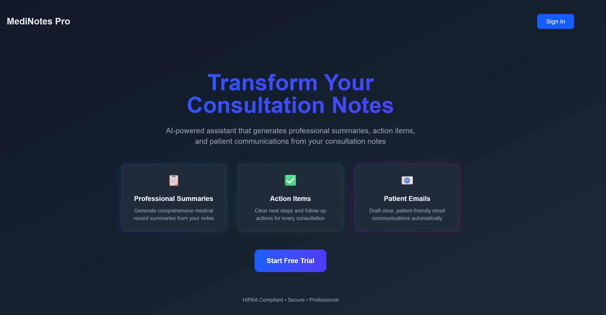

# 🔐 LLMOps – Healthcare App

### 🧾 Authentication & Subscription Setup Branch

This branch adds **full Clerk authentication** and **subscription-based access control**, transforming the Healthcare App into a secure, production-ready SaaS platform.
Users can now:

* Sign in using modern authentication providers
* Obtain secure Clerk-issued JWTs
* Access plan-gated clinical features
* Subscribe to premium plans
* Manage billing & subscription settings directly via Clerk

This is the foundation that enables your AI-powered healthcare application to serve real users safely and professionally.

## 🧩 Overview

This combined stage sets up:

### 🔐 1. User Authentication

* Email, Google, GitHub (and optionally Apple) sign-in
* JWT issuance by Clerk
* Backend verification using Clerk **JWKS**
* Secure environment variable configuration

### 💳 2. Subscription & Billing

* A premium plan (`premium_subscription`)
* Subscription purchasing via Clerk Billing
* Automatic access control using:

  ```tsx
  <Protect plan="premium_subscription">
  ```
* Subscription management through `<UserButton />`

When both parts are complete, only subscribed, authenticated users can access premium clinical functionality.

## 🧑‍💻 Authentication Setup

### Step 1: Create a Clerk Account

1. Go to **clerk.com** → Sign Up
2. Create your account
3. Create a new **Application**

### Step 2: Configure Application Sign-In

Enable:

* Email
* Google
* GitHub
* Apple (optional)

### Step 3: Add Authentication Environment Variables

Create `.env.local`:

```env
NEXT_PUBLIC_CLERK_PUBLISHABLE_KEY=your_publishable_key_here
CLERK_SECRET_KEY=your_secret_key_here
```

Add `.env.local` to `.gitignore`.

### Step 4: Configure Backend JWT Verification (JWKS)

In Clerk Dashboard:

* Configure → API Keys → Copy **JWKS URL**

Add to `.env.local`:

```env
CLERK_JWKS_URL=your_jwks_url_here
```

This allows your FastAPI backend to verify Clerk-issued tokens cryptographically.

### Step 5: Add Env Vars to Vercel

```bash
vercel env add NEXT_PUBLIC_CLERK_PUBLISHABLE_KEY
vercel env add CLERK_SECRET_KEY
vercel env add CLERK_JWKS_URL
```

Add them to all environments (development, preview, production).

## 💳 Subscription Setup

### Step 6: Enable Clerk Billing

* Clerk Dashboard → Configure → **Subscription Plans**
* Enable Billing

### Step 7: Create the Premium Subscription Plan

Use **exact plan key:**

```
premium_subscription
```

Configure pricing (monthly, optional annual billing).
Save the plan.

### Step 8: (Optional) Connect Stripe

* Billing → Settings
* Switch to Stripe if you want real payments
* Otherwise, Clerk's built-in gateway handles test mode subscriptions

### Step 9: Test the Subscription Flow

1. Deploy
2. Sign in
3. Navigate to `/product`
4. If unsubscribed → `PricingTable` appears
5. Subscribe
6. Access unlocks instantly

### Step 10: Manage Subscriptions

Accessible through:

```
<UserButton />
```

Users can view/cancel/change their subscription directly in the Clerk dashboard.

## 🧠 How Everything Works Together

### Frontend

* Clerk handles the authentication UI
* JWT obtained via `getToken()` is sent to the backend
* Premium pages use `<Protect plan="premium_subscription">`

### Backend

* FastAPI verifies JWT using Clerk’s JWKS
* The clinical `/api` endpoint ensures secure, authenticated access

### Billing

* Clerk or Stripe processes payments
* Subscription status is synced automatically
* No backend modifications required

## 🛠️ Troubleshooting

**“Plan not found”**

* Check that plan key is **exactly** `premium_subscription`
* Make sure Billing is enabled

**Pricing table still showing after subscribing**

* Sign out/in
* Check subscription status in Clerk dashboard

**403 errors from backend**

* Verify JWKS URL
* Ensure Authorization header: `Bearer <JWT>`

## 📦 Deploying Your Application for the First Time

Now that Clerk authentication and subscriptions are fully configured, you can deploy the Healthcare App.

### Step 1 — Initial Production Deployment

Run:

```bash
vercel .
```

Because this is your *first deployment*, Vercel will treat this as a **production deployment** automatically and give you a live URL.

### Step 2 — Deploying Updates Afterward

By default:

```bash
vercel .
```

deploys to **preview**.

To deploy updates to **production**, use:

```bash
vercel --prod
```

This ensures your changes go live safely and intentionally.

### 📸 Example Output After First Deployment

Below is what you should expect to see after running the first deployment command:

<p align="center">
  
</p>

This confirms that the app has successfully built, deployed, and is live in production.

## ✅ Completion Checklist

| Component                       | Description                                         | Status |
| ------------------------------- | --------------------------------------------------- | :----: |
| Authentication Enabled          | Clerk login, JWTs, and env vars configured          |    ✅   |
| Backend JWT Verification Active | FastAPI verifies Clerk tokens via JWKS              |    ✅   |
| Billing Enabled                 | Subscription plans active in Clerk                  |    ✅   |
| Premium Plan Created            | `premium_subscription` created and active           |    ✅   |
| Product Page Protected          | `<Protect plan="premium_subscription">` applied     |    ✅   |
| PricingTable Fallback Working   | Non-subscribed users see correct upgrade prompt     |    ✅   |
| Subscription Upgrade Flow Works | Users can subscribe and gain access instantly       |    ✅   |
| User Subscription Management    | Managed via `<UserButton />`                        |    ✅   |
| Initial Production Deployment   | Completed using `vercel .`                          |    ✅   |
| Ongoing Deployments             | Ready to use `vercel --prod` for production updates |    ✅   |
